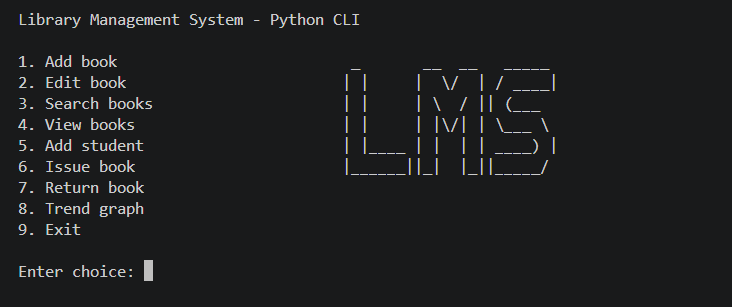

# Library Management System

## Overview
This project is a simple Library Management System. The goal was to replace manual record keeping with a basic computer-based system that can manage books, students, and transactions.

The system is built using both Python and Java. Python handles the core library operations through a command-line interface, while Java (JavaFX) is used to provide a graphical interface for reporting and data processing.

---

## Features

### Python Application
The Python program allows the user to:
- Add, update, search, and view books  
- Validate ISBN-13 numbers using a check digit algorithm  
- Add student records  
- Issue and return books  
- Store and manage data using CSV files  
- Handle invalid inputs with appropriate error messages

### Python Terminal

---

### JavaFX Application
The Java program provides a graphical interface to:
- Load and validate data from CSV files  
- View books, students, and transactions  
- Generate a books issued report for a selected date  
- Calculate the average price of books  
- Search for books by title (including prefix search using *)  
- Export search results to a text file

### FX

---

## Technologies Used
- Python (developed using PyCharm)  
- Java with JavaFX (developed using IntelliJ IDEA)  
- CSV files for storing data  
- JUnit for basic testing  

---

## How to Run

### Python Program
1. Open the project in PyCharm / VS Code 
2. Run `python library.py`  
3. Follow the menu options in the terminal  

### Java Program
1. Open the project in IntelliJ IDEA  
2. Run `LibraryFxApp.java`  
3. Use the buttons in the interface to perform actions  

---

## Testing
Basic testing was carried out using:
- Desk check for Python functions  
- JUnit test cases for selected Java methods  

---

## Author
mkm.connects aka Manuja Keshara

---

## Note
Feel free to donwload the app, use to your personal preference and edit the code to your need.
